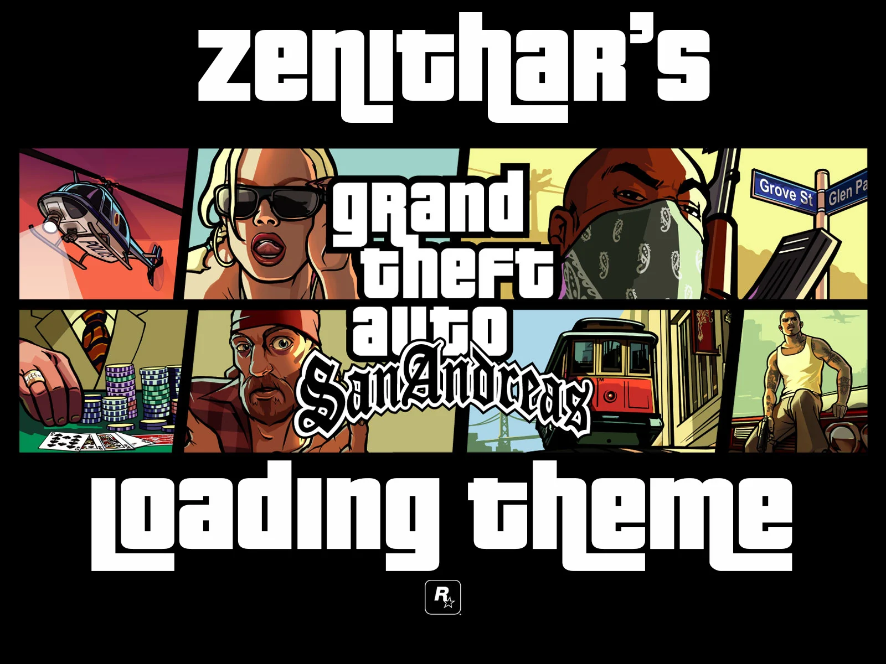

# Grand Theft Auto: San Andreas Reverse Engineering Project



## Project Overview

This project focuses on reverse engineering the popular video game **Grand Theft Auto: San Andreas**. The goal is to analyze and understand the inner workings of the game by reversing the functions and mechanics that make up its gameplay. This includes studying the executable files, game mechanics, and the underlying architecture used by the developers.

By reverse engineering, we aim to:

- Understand how various systems (graphics, physics, AI) operate.
- Identify key functions responsible for game logic and mechanics.
- Document the findings and share insights with the reverse engineering community.

## Scope of Work

This project will reverse engineer many of the core functions of **Grand Theft Auto: San Andreas**, including but not limited to:

- **Player Controls and Movement**: Understanding how player inputs are handled and translated into character movement.
- **Physics Engine**: Investigating how objects in the game world interact with each other (e.g., car collisions, bullet trajectories).
- **AI Behavior**: Analyzing how non-player characters (NPCs) behave and respond to the player's actions.
- **Rendering Pipeline**: Examining how the game renders the environment, characters, and effects like weather and lighting.
- **Audio Systems**: Reversing how sound effects, music, and dialogues are managed.
- **Scripting Engine**: Understanding the mission logic and scripted events in the game.

## Tools and Techniques

This project will use a combination of the following tools:

- **IDA Pro/Ghidra**: For disassembly and decompilation of the game binaries.
- **Cheat Engine**: To inspect memory and identify key game variables.
- **Hex Editors**: For inspecting and modifying game data.
- **Debugger**: To step through the code execution and identify key functions.
- **Custom Scripts**: For automating parts of the reversing process.

## Legal Disclaimer

This project is for educational purposes only. No copyrighted material from Rockstar Games or any affiliated entities is distributed through this project. The focus is solely on reverse engineering techniques, and all findings will be shared responsibly without infringing on intellectual property rights.

## Installation

To get started, clone this repository:

```bash
git clone https://github.com/your-repo/gta-san-andreas-reverse-engineering.git
cd gta-san-andreas-reverse-engineering
